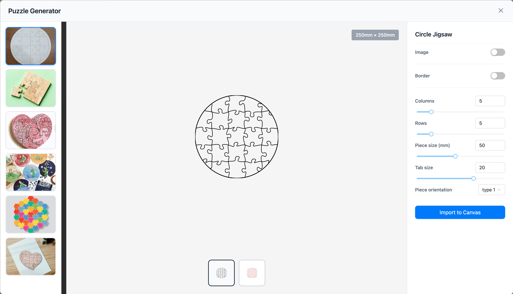

# SPEC

## Puzzle Generator

A puzzle generator feature for Beam Studio that creates jigsaw puzzles for laser cutting purposes using Konva.js.

### Entry Point

Located in the **Generators** section of the app, alongside Box Generator, Code Generator, and Material Test Generator.

---

## UI Layout

The puzzle generator opens as a **full-viewport modal dialog** with three main sections:

```
┌─────────────────────────────────────────────────────────────────────────────┐
│ Puzzle Generator                                                          X │
├──────────┬──────────────────────────────────────────────────┬───────────────┤
│          │                              [250mm × 250mm]     │ Circle Jigsaw │
│  [Type]  │                                                  │               │
│  [Type]  │              PREVIEW AREA                        │  [Options]    │
│  [Type]  │                                                  │  [Controls]   │
│          │                                                  │               │
│          │                  ┌──┐ ┌──┐                       │               │
│          │                  │▦▦│ │░░│                       │ [Import Btn]  │
│          │                  └──┘ └──┘                       │               │
└──────────┴──────────────────────────────────────────────────┴───────────────┘
```

**Modal Dimensions:**
- Width: `calc(100vw - 64px)` (full viewport minus padding)
- Height: `calc(100vh - 100px)` (full viewport minus header/footer)
- Mobile: `flex-direction: column`, `max-height: 80svh`

### 1. Left Sidebar - Puzzle Type Selection

- **Display**: Photo thumbnails of laser-cut puzzle examples (static images)
- **Function**: Clickable type selectors
- **Behavior**: Clicking a type resets all options to that type's default values

**Available Types:**

1. Circle Jigsaw (ellipse that fits full grid dimensions)
2. Rectangle Jigsaw
3. Heart Jigsaw

### 2. Center - Preview Area

- **Auto-fit**: Preview always scales to show the entire puzzle
- **Size Display**: Shows current puzzle dimensions (e.g., "250mm × 250mm") in top-right corner
- **Real-time Updates**: Preview updates immediately as user adjusts settings
- **Edge-based Rendering**: Uses horizontal + vertical edge paths for accurate preview
- **Clipping**: Non-rectangular shapes use reusable SVG boundary path for clipping

**View Toggle Buttons** (bottom center):

- **Assembled View**: Shows puzzle as it would look when assembled (default)
- **Layer View**: Shows exported layers separately (puzzle + border as distinct shapes)
  - Useful for understanding which cuts will be on separate materials
  - Available for all puzzle types

### 3. Right Panel - Options & Controls

**Header**: Displays current puzzle type name (e.g., "Circle Jigsaw")

#### Options

**Image** (Toggle Checkbox) — *[Deferred: Infrastructure present but feature incomplete]*

- When enabled, reveals an expandable/accordion section containing:
  - **Upload Area**: Supports drag-and-drop onto preview area AND file picker button
  - **Supported Formats**: JPG, PNG, WebP (max 10MB, 4000px)
  - **Zoom**: Slider 25% - 400% (default: 100%)
  - **X Offset**: Slider -1000 to 1000 (default: 0)
  - **Y Offset**: Slider -1000 to 1000 (default: 0)
  - **Export As**: Dropdown - Printing Layer or Engraving Layer
- **Image Behavior**:
  - Clipped to puzzle shape boundary
  - Default positioning: Center and cover (maintains aspect ratio, crops excess)
  - Transform affects assembled puzzle view; each piece inherits its portion

**Border** (Toggle Checkbox)

- When enabled, adds outer frame border around entire puzzle perimeter
- **Width**: Slider + number input, 1mm - 20mm (step: 0.5mm)
- **Radius**: Slider + number input, 0 - 50
  - Rectangle: Controls corner rounding
  - Heart: Controls bottom point sharpness (0 = sharp point, 50 = rounded)
  - Circle: Hidden (circles have no corners)
- **Puzzle Outlines** (Toggle) — *[Future: Phase 5]*
  - When enabled, engraves complete puzzle edge pattern (including tabs) onto the border frame
  - Creates a visual guide for puzzle assembly

**Columns**

- Slider + number input
- Range: 2 - 20
- Default: 5

**Rows**

- Slider + number input
- Range: 2 - 20
- Default: 5

**Piece Size (mm)**

- Slider + number input
- Range: 10mm - 100mm
- Default: 15mm

**Tab Size**

- Slider + number input
- Range: 0 - 30 (display value; internally converted to 0-12% via `value * 0.4 / 100`)
- Default: 20 (= 8% actual tab size)
- *Note: 0 creates simple grid pieces with no interlocking tabs*

**Piece Orientation**

- Dropdown select
- Options: Type 1, Type 2, Type 3, Type 4
- Represents different tab placement patterns (seeded random based on orientation)

**Import to Canvas** (Primary Button)

- Generates puzzle and imports to Beam Studio canvas
- Placement: Center of current workarea
- Closes modal after successful import
- *[Future: Show loading indicator if export takes > 500ms]*

---

## Technical Specifications

### Architecture Decisions

1. **Schema-driven Configuration**: Keep the extensible property schema system for future puzzle types
2. **Multi-pass Merging Algorithm**: Keep the 3-pass approach for handling edge cases in non-rectangular shapes
3. **Full Tab Jitter System**: Keep Draradech's algorithm with 5 coefficients for natural-looking tabs
4. **Centered Coordinate System**: Keep origin at (0,0) with translation on export
5. **ts-pattern for Matching**: Keep the library for exhaustive pattern matching

### Grid & Shape Behavior

**Rectangle Jigsaw**

- Standard rectangular grid based on Columns × Rows
- All edge pieces have flat outer edges
- No clipping required
- Border radius controls corner rounding

**Circle Jigsaw (Ellipse)**

- Uses "truncate-at-boundary" approach: rectangular grid is generated, then clipped by ellipse
- Ellipse fits full grid dimensions (width × height), not min(width, height)
- Edge pieces are clipped to ellipse boundary
- Small pieces (< 50% visible) are merged with neighbors
- No border radius option (circles have no corners)

**Heart Jigsaw**

- Uses "truncate-at-boundary" approach: rectangular grid is generated, then clipped by heart shape
- Heart uses Bezier curves with `topCurveHeight = height * 0.3`
- Bottom curves are more linear for a cleaner look
- Small pieces (< 50% visible) are merged with neighbors
- Border radius controls bottom point sharpness

### Shape Path Consolidation

A single reusable shape generator will be used for:
- Boundary generation in puzzleGenerator.ts
- Clip path in puzzleTypes.config.ts
- Preview clipping in Preview.tsx (via SVG path, not canvas clipFunc)
- Border path generation

### Small Piece Merging Algorithm

For non-rectangular shapes, pieces with < 50% visibility are merged:

1. **Pass 0 - Very Small Corners (< 25%)**: Handle corner pieces with extended neighbor search including diagonal bridging
2. **Pass 1 - Horizontal Merging**: Right → Left priority, creates horizontal strips
3. **Pass 2 - Vertical Merging**: Bottom → Top priority, handles remaining pieces
4. **Pass 3 - Expansion**: Expand groups until combined visibility ≥ 80%

**Merge Direction Priority**: right → left → bottom → top

### Tab Generation Algorithm

**Pattern**: Seeded random via `generateJitterMap()` based on orientation

- Each orientation (1-4) has a unique seed for distinct visual character
- Random flip direction per tab creates variety
- 5 jitter coefficients (a, b, c, d, e) per tab for natural variation

**Tab Shape**: 10-point Bezier curves (Draradech algorithm)

- Three cubic Bezier segments per tab
- `TAB_DEPTH_MULTIPLIER = 3.0` controls tab depth relative to size
- Smooth curves for clean laser cutting

**Tab Size Conversion**:

- Display value: 0-30 (user-facing slider)
- Internal fraction: `(displayValue * 0.4) / 100` = 0-0.12 (0-12%)
- 30 steps with 0.4% increments prevent tab overlap

### Coordinate System (Centered)

- Puzzle is centered at origin (0, 0)
- `calculatePuzzleLayout()` returns negative offsets (`-width/2`, `-height/2`)
- Adding rows/columns expands symmetrically from center
- Export translates to positive coordinates for canvas placement

### Performance Optimizations

**Visibility Memoization**:
- Cache piece visibility calculations per piece
- Recalculate only when pieceSize, rows, columns, or shape type changes
- Sampling uses 5×5 grid + 4 corners + 12 tab samples = 41 points per piece

### Size Validation — *[Future: Phase 5]*

**Constraints**: Based on maximum workarea from `workarea-constants.ts`

- **Warning**: Displayed when puzzle exceeds largest workarea size
- **Behavior**: Warning shown but generation is allowed (user may have larger machine)

**Kerf Compensation**: None

- User handles kerf adjustment in their laser cutting software
- Generator outputs exact mathematical paths

### Export/Output

**Layers** (with descriptive auto-naming for cut order/material separation):

1. **Puzzle Inner Cuts**: Combined horizontal + vertical edge paths for laser cutting
   - For non-rectangular shapes, uses SVG `<clipPath>` to clip edges to boundary
2. **Puzzle Boundary**: Shape outline (circle/heart/rectangle) - cuts the puzzle from material
3. **Puzzle Border (Separate Material)**: Outer frame path (if Border enabled, with border width offset)
   - Indicates this layer should be cut on a separate piece of material
4. **Puzzle Outline Engrave** — *[Future: Phase 5]*: Complete edge pattern on border (if Puzzle Outlines enabled)

**SVG Export with Clip-Path** (for non-rectangular shapes):

```svg
<svg>
  <defs>
    <clipPath id="boundaryClip">
      <path d="[boundary shape at origin]"/>
    </clipPath>
  </defs>
  <g transform="translate(width/2, height/2)">
    <g clip-path="url(#boundaryClip)">
      <path d="[edge cuts]" stroke-width="0.1"/>
    </g>
  </g>
</svg>
```

**Stroke Width**: 0.1mm for visibility in preview software

---

## Default Values

| Parameter | Default |
|-----------|---------|
| Puzzle Type | Circle Jigsaw |
| Columns | 5 |
| Rows | 5 |
| Piece Size | 15mm |
| Tab Size | 20 (display) / 8% (actual) |
| Piece Orientation | Type 1 |
| Image | Disabled |
| Border | Disabled |
| Border Width | 5mm |
| Border Radius | 0 |
| Image Zoom | 100% |
| Image X Offset | 0 |
| Image Y Offset | 0 |
| Image Export As | Printing Layer |

*Note: Each puzzle type may have different default values in future iterations*

---

## Modal Behavior

**State Persistence**: None

- Modal resets to default values each time it opens
- No preset/template system

**Close Methods**:

- X button in top-right corner
- ESC key support (standard modal behavior)
- Cancel button in footer

**After Import**:

- Modal closes automatically after successful import to canvas

**Type Switching**:

- Changing puzzle type resets all options to that type's defaults

**Undo/Redo**: Not needed

- Settings are simple enough for manual readjustment

---

## Accessibility

**Focus**: Mouse/touch-focused interface

- Basic keyboard support (Enter/Space for type selection)
- No advanced screen reader support required

---

## Edge Cases

**Very Small/Large Puzzles** (e.g., 2x2 or 20x20):

- No special handling or warnings
- Allow any combination within the defined ranges

**Extreme Image Aspect Ratios**:

- Image is centered and scaled to cover puzzle area
- Excess portions are cropped
- User can adjust with zoom and offset controls

**Pieces Completely Outside Boundary**:

- Pieces with ≤ 1% visibility are skipped entirely
- No edges are generated for completely outside pieces

---

## i18n Requirements

All user-facing strings must use the i18n system under `puzzle_generator` namespace:

- Type names: `types.circle_jigsaw`, `types.rectangle_jigsaw`, `types.heart_jigsaw`
- Property labels: `columns`, `rows`, `piece_size`, `tab_size`, `orientation`, etc.
- Action buttons: `import_to_canvas`, `cancel`
- View modes: `assembled_view`, `layer_view`
- Validation messages and warnings

**No hardcoded fallback strings** - all text must have i18n keys.

---

## Type Cleanup

Remove unused type definitions:
- `warpedCircle` and `warpedHeart` in GridGeneratorType (use `circle` and `heart`)
- Align all types with actual config values

Use strict union type: `'rectangle' | 'circle' | 'heart'`

---

## File Structure

```
packages/core/src/web/app/components/dialogs/PuzzleGenerator/
├── index.tsx                    # Main modal with 3-panel layout
├── index.module.scss            # Styles (responsive, mobile support)
├── types.ts                     # TypeScript interfaces & state factories
├── puzzleTypes.config.ts        # Circle, Rectangle, Heart configs
├── TypeSelector.tsx             # Left sidebar thumbnails
├── Preview.tsx                  # Konva canvas preview (edge-based, SVG path clipping)
├── OptionsPanel.tsx             # Right panel wrapper
├── PropertyRenderer.tsx         # Dynamic form generator (slider, toggle, select, group, image-upload)
├── puzzleGenerator.ts           # Edge-based puzzle generation algorithm with merging
├── shapeGenerators.ts           # [NEW] Consolidated shape path generators (ellipse, heart, rectangle)
└── svgExport.ts                 # Export to canvas with SVG clip-path
```

---

## Phase Checklist

### Phase 1: Foundation ✅

- [x] Design flexible configuration system
- [x] Create `types.ts` with property definitions and state shape
- [x] Create `puzzleTypes.config.ts` with type configurations
- [x] Create main modal component (`index.tsx`)
- [x] Create `TypeSelector.tsx` - left sidebar
- [x] Create `OptionsPanel.tsx` - right panel wrapper
- [x] Create `PropertyRenderer.tsx` - generic form renderer
- [x] Create `index.module.scss` - styling
- [x] Register in `generators.config.tsx`
- [x] Add `showPuzzleGenerator` function
- [x] Add i18n entries
- [x] Verify build passes

### Phase 2: Preview Canvas ✅

- [x] Create Konva Stage/Layer setup in `Preview.tsx`
- [x] Implement basic grid rendering (rectangle)
- [x] Implement jigsaw tab generation algorithm (Bezier curves)
- [x] Implement seeded random tab pattern with jitter
- [x] Add real-time preview updates
- [x] Implement assembled view
- [x] Implement circle shape boundary (ellipse fitting full grid)
- [x] Implement heart shape boundary (Bezier curves)
- [x] Fix puzzle centering (centered at origin)
- [x] Rewrite to edge-based algorithm (proper interlocking)
- [x] Implement boundary clipping for preview

### Phase 3: Export to Canvas ✅

- [x] Create `svgExport.ts`
- [x] Generate SVG paths from puzzle edges
- [x] Implement small piece merging (< 50% threshold)
- [x] Implement iterative merging until ≥ 80% visibility
- [x] Implement merge direction priority
- [x] Export puzzle cuts layer
- [x] Export boundary layer
- [x] Export border layer (if enabled)
- [x] Translate centered paths to positive coordinates
- [x] Add proper layer naming
- [x] Close modal after import
- [x] Implement SVG clip-path for non-rectangular shape export

### Phase 4: Refactoring & Performance 🔲

- [ ] **Consolidate shape generators** into single `shapeGenerators.ts` file
- [ ] **Remove unused Paper.js code** from svgExport.ts (processPuzzlePieces, intersection functions)
- [ ] **Clean up types** - remove warpedCircle/warpedHeart, use strict union
- [ ] **Update Preview.tsx** to use SVG path for clipping instead of canvas clipFunc
- [ ] **Add visibility memoization** - cache per piece, recalc on relevant state changes
- [ ] **Update layer names** to indicate cut order/material separation
- [ ] **Heart border radius** - implement bottom point sharpness control
- [ ] **Layer view toggle** - implement for all puzzle types
- [ ] **Modal sizing** - update to full viewport dimensions
- [ ] **i18n audit** - ensure all strings use i18n, remove hardcoded fallbacks

### Phase 5: Future Features 🔲

- [ ] Add thumbnail images for type selector
- [ ] Implement workarea size validation warning
- [ ] Implement loading state during export (if > 500ms)
- [ ] Implement "Puzzle Outlines" feature on border (engrave edges onto frame)
- [ ] Complete image overlay support
- [ ] Test with different puzzle configurations
- [ ] Test mobile layout

---

## UI Reference



The mockup shows:

- Left sidebar with photo thumbnails for type selection
- Center preview with auto-fit scaling and dimension display
- Bottom toggle buttons for assembled/layer views
- Right panel with all configuration options
- Blue "Import to Canvas" primary action button
